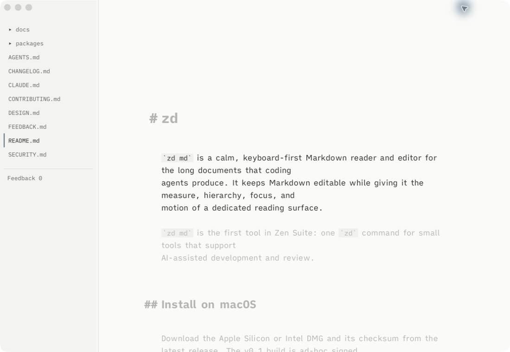

# zd

`zd md` is a calm, keyboard-first Markdown reader and editor for the long documents that coding
agents produce. It keeps Markdown editable while giving it the measure, hierarchy, focus, and
motion of a dedicated reading surface.

`zd md` is the first tool in Zen Suite: one `zd` command for small tools that support
AI-assisted development and review.



## Install on macOS

Download the Apple Silicon or Intel DMG and its checksum from the
[latest release](https://github.com/iammrduncan/zd/releases/latest). The v0.1 build is ad-hoc signed,
but not Developer ID signed or notarized.

Follow the [macOS installation guide](docs/how-to/install-macos.md) to verify the download, copy the
app, and put `zd` on PATH.

## Open a document

```sh
zd md .              # open the current folder
zd md README.md      # open one file
zd md                # open without a document
```

Relative paths resolve from the directory where the command is run. A named file can be new; `zd`
creates it on the first save.

Once a document is open, hold `Cmd+.` (`Ctrl+.` off macOS) to see the live shortcut reference.

## What is in v0.1

- One rendered, always-editable Markdown surface—no preview/edit mode switch.
- Line, paragraph, and section focus with optional typewriter motion.
- Headings, lists, quotes, code, links, images, and tables shaped for reading.
- Folder workspaces, safe saves, external-change detection, and Markdown file association.
- Local fonts and local files by default; remote images are not fetched.

macOS is the primary v0.1 target. Windows packaging is still pending.

## Documentation

| If you want to… | Start here |
| --- | --- |
| Learn the reading and editing flow | [Open your first document](docs/tutorials/first-document.md) |
| Install or update the macOS app | [Install on macOS](docs/how-to/install-macos.md) |
| Look up command-line behavior | [CLI reference](docs/reference/cli.md) |
| Understand the system boundaries | [Architecture](docs/explanation/architecture.md) |
| Browse every guide and project record | [Documentation map](docs/README.md) |

## Develop

```sh
npm ci
npm run app
npm run check
```

See [Develop zd](docs/how-to/develop.md) for browser and native workflows. Contributions are
welcome; read [CONTRIBUTING.md](CONTRIBUTING.md) before opening a change.

## Project status

The product contract is [docs/vision.md](docs/vision.md), the design system is
[DESIGN.md](DESIGN.md), and current work lives in [docs/todo.txt](docs/todo.txt).

Licensed under the [MIT License](LICENSE).
