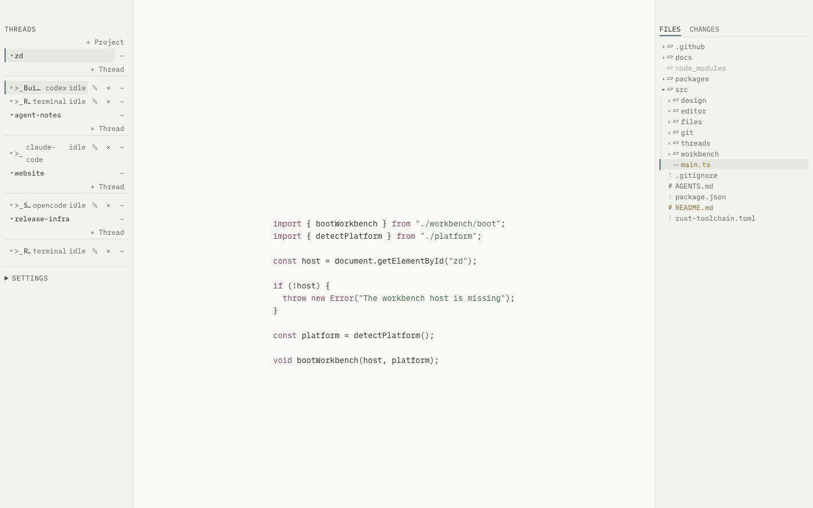

[Website](https://getzensuite.com) &nbsp;·&nbsp; [docs](https://getzensuite.com/docs) &nbsp;·&nbsp; [Discord](https://discord.gg/3Qs2uejUf9)

> `zd` is under heavy development. Expect fast changes while the workbench settles.

# zd

ZenSuite’s `zd` is a fast, local agent workbench for projects, threads, terminals, files, and Git.
Keep several repositories and agent sessions in one quiet window, edit the current file, and inspect
changes without handing a web service your source tree.



## Install

Download the Apple Silicon or Intel DMG, or the Windows x64 setup executable, and its checksum from
the [latest release](https://github.com/iammrduncan/zd/releases/latest).

Current macOS builds are ad-hoc signed but not Developer ID signed or notarized. If macOS shows
**“zd” Not Opened** after the checksum passes, choose **Done**, then use System Settings → Privacy &
Security → **Open Anyway**. The [macOS installation guide](docs/user-facing-docs/how-to/install-macos.md#if-macos-says-zd-not-opened)
has the complete recovery path. Current Windows installers are not code signed; see the
[Windows installation guide](docs/user-facing-docs/how-to/install-windows.md) before accepting a
SmartScreen warning.

## Start a workbench

```sh
zd                 # open the workbench
zd .               # open the current folder as a project
zd README.md       # open one file and approve its parent project
```

Relative paths resolve from the directory where you run the command. A named file may be new; `zd`
creates it on the first successful save.

## What is available

- Several approved projects and Git worktrees in one root window.
- Project-scoped terminal threads for a shell, Codex, Claude Code, or OpenCode workflow.
- A compact, keyboard-accessible file tree with file type and Git state.
- CodeMirror editing for Markdown and common code/configuration languages, including rendered
  Mermaid fences and standalone `.mmd` / `.mermaid` diagrams, with bounded large-file states and
  Find/Replace.
- Read-only Git status, commit history, revision comparison, and file diffs.
- Current Light, Dark, Dracula, and validated local theme files.
- A global quick-access shortcut that reuses the running workbench.
- Optional local diagnostics. Desktop completion notifications and sounds are opt-in and currently
  available on macOS.

Hold `Cmd+.` on macOS or `Ctrl+.` elsewhere for the live shortcut reference. Focus Mode, completion
sound, desktop notifications, and local diagnostics are off by default.

## Documentation

| If you want to… | Start here |
| --- | --- |
| Learn the core project, thread, file, and Git loop | [Start your first workbench](docs/user-facing-docs/tutorials/first-workbench.md) |
| Organize projects and terminal threads | [Manage projects and threads](docs/user-facing-docs/how-to/manage-projects-and-threads.md) |
| Review working-tree or historical changes | [Inspect Git changes](docs/user-facing-docs/how-to/inspect-changes.md) |
| Install or update on macOS | [Install on macOS](docs/user-facing-docs/how-to/install-macos.md) |
| Install or update on Windows | [Install on Windows](docs/user-facing-docs/how-to/install-windows.md) |
| Look up launch behavior | [CLI reference](docs/user-facing-docs/reference/cli.md) |
| Understand the security boundaries | [Architecture](docs/user-facing-docs/explanation/architecture.md) |
| Browse every document type | [Documentation map](docs/README.md) |

## Develop

```sh
npm ci
npm run app
npm run dev:website
npm run check
```

See [Develop zd](docs/user-facing-docs/how-to/develop.md) and [CONTRIBUTING.md](CONTRIBUTING.md).
The canonical design contract is [DESIGN.md](docs/DESIGN.md).

Licensed under the [MIT License](LICENSE). File-tree glyphs use Microsoft
[Codicons](https://github.com/microsoft/vscode-codicons), licensed under CC BY 4.0.
