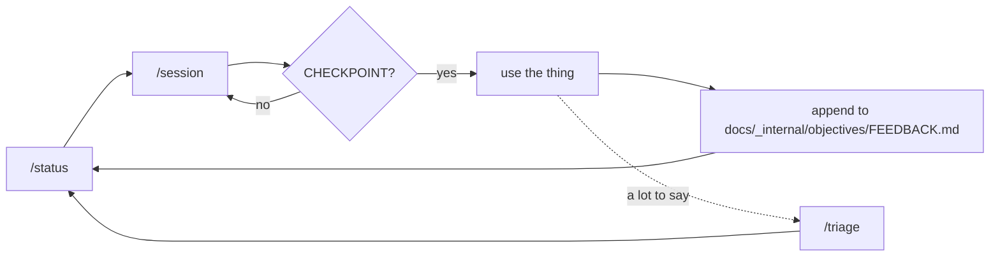

# The way of working

Four slash commands, two inboxes, and a text file that is both the plan and the log.

This is the loop `zd` is built with, packaged so it can be dropped into any repo. It is small on
purpose: nothing to install, no database, no ceremony. The whole system is four markdown files and
a `todo.txt`, and it is legible to a human with `cat`.

It exists because the previous attempt at the product it came from ran for 18 hours, produced 73
commits and ~175,000 lines, and ended with no app anybody could use. Every rule below is a direct
answer to something in that autopsy — none of them are style preferences, and the ones that read
as arbitrary are the ones that cost the most.

Everything you need is in this folder. Nothing here links out of it.

| | |
| --- | --- |
| [`commands/`](commands/) | The four commands, generalized. Copy into `.claude/commands/`. |
| [`templates/`](templates/) | The files they read and write, plus the standing instructions. Copy and start using. |
| [`task-format.md`](task-format.md) | The `todo.txt` line grammar. |
| [`diagnosis.md`](diagnosis.md) | Four rules for finding out what is true, each one paid for. |
| [`anchor-documents.md`](anchor-documents.md) | The `vision.md` / `DESIGN.md` / plan convention the commands read from. Start here if you are adopting this. |

## The loop



`/status` to decide, `/session` to do one thing, and repeat until the plan says stop. Then **go
use what you built**. What you hit while using it goes into `docs/_internal/objectives/FEEDBACK.md` as a raw line, and the
next session triages that before it touches the plan. Real usage outranks the plan — that is the
entire point of the arrangement.

## Driving it

You do not sit and type `/session` all day. The command that does the work is:

```
/loop 60s /session until you reach the next checkpoint
```

Sessions run back to back — each one still triages the inbox first, takes one task, tests it, and
commits it — and the run stops at the next `CHECKPOINT` line in the task list, which is where the
plan says a human has to go and use the thing. Come back, use it, write raw lines into
`docs/_internal/objectives/FEEDBACK.md`, and start the next loop.

**The `60s` is a gap, not a schedule.** A session finishes, sixty seconds pass, the next one
starts. It is short enough that an unattended run is still effectively continuous, and long enough
to matter for the two things that happen in it:

- **You can get in.** `/session` ends by naming exactly what to open and what to look at. If you
  are at the desk, that sentence is your cue — a minute is enough to read it, and enough to stop
  the run before it takes another task. Without a gap, the handoff scrolls past under the next
  session's triage output and the only way in is to race it.
- **The work is committed and quiet.** The gap lands where the tree is clean and nothing is
  half-done: the previous session has committed or cut scope and committed, and the next has not
  started. That is the safe moment to interrupt, `git log`, or append to `docs/_internal/objectives/FEEDBACK.md` without
  writing into a file a session is about to reset.

Sixty seconds is the default because it is cheap. Widen it if you want a real chance to intervene
between sessions; do not drop it to zero, because a run with no seam is a run you can only stop by
killing it.

**The terminal condition is the whole trick.** An outer loop is fine when it has a stopping
condition and fatal when it does not, and the difference is not a matter of degree. The 18-hour
run behind this workflow was driven by *"work until all AC are completed"* against a goal with no
checkable end — that is the same sentence shape with the brake removed. Here the stopping
condition lives in the task list rather than in the prompt, so it is a line you wrote deliberately,
in advance, while you were still being honest about how much you could build before needing to
look at it.

Which means: **put the checkpoints in before you start looping.** A plan with no `CHECKPOINT`
lines, run under a loop, is the old failure mode with better tooling. One at the end of every
phase, and one wherever you genuinely do not know whether the next thing is right.

Claude Code provides `/loop <interval> <prompt>`. In Codex, this repository provides the same
checkpoint-bounded outer loop:

```sh
npm run zdloop -- 60s
```

It invokes `$zd-session` once per open task, appends each final handoff to
`docs/_internal/objectives/session-memory.log`, waits only when another session is needed, and checks both
`docs/_internal/objectives/FEEDBACK.md` and the task list before every invocation. Pending feedback forces a session even
when the checkpoint is already next; that session triages the inbox and takes the first resulting
live-band task. The runner then stops if the inbox is empty and nothing landed above the
checkpoint. At that point it runs one additional read-only Codex session, with approvals disabled,
to compare the ending commits against the commit where the loop started and produce a prioritized
manual test and feedback guide. That final recap is printed and appended to
`docs/_internal/objectives/session-memory.log` like the work-session handoffs. Preview the current task snapshot,
pending feedback, minimum session count, work prompt, and final recap prompt without invoking
Codex or changing files:

Interactive terminals open a live dashboard instead of printing Codex's event stream as a wall of
text. It shows the tasks before the checkpoint, recently completed tasks, feedback processed in
the current run, the active task, and a compact stream of commands, file changes, tools, and agent
messages. Codex is invoked with its JSON event output in this mode, so the runner can label and
format each event without changing the raw final handoff saved to
`docs/_internal/objectives/session-memory.log`.

Non-agent events use deterministic local labels in a stable
`ONE TO THREE WORD ACTION | one-sentence description` shape. This keeps the dashboard useful
without downloading a display model, adding native inference dependencies, or sending tool events
to a separate service. Agent responses bypass the labels and render as Markdown in the stream.

The dashboard controls are:

- `s` requests a graceful stop. The active work session is allowed to finish, the read-only recap
  runs, and the dashboard pauses on its formatted summary.
- `x` or `Ctrl+C` kills the active Codex process immediately and exits with status 130. It does not
  run a recap.
- On the summary screen, `c` rechecks `docs/_internal/objectives/FEEDBACK.md` and the live task band and continues when work
  exists; `q` or `x` exits. If the checkpoint is still next, the dashboard remains paused instead
  of running past it. Use `j` and `k` to scroll a long recap.

At a natural checkpoint the dashboard also pauses on the recap, so the testing guide remains on
screen until you explicitly continue or quit. Redirected output, CI, and other non-TTY runs keep
the original one-shot behavior: they print styled Markdown when color is enabled and exit after
the recap. Pass `--no-tui` to request that behavior in a terminal. `NO_COLOR` disables terminal
styling and `FORCE_COLOR=1` enables it explicitly.

```sh
npm run zdloop -- 60s --dry-run
```

Archive completed lines deterministically with:

```sh
npm run zdarchive
```

It appends every line beginning with `x ` to `docs/_internal/objectives/todo-archive.txt` in file order, then removes
exactly those lines from `docs/_internal/objectives/todo.txt` while preserving open work and checkpoints.

## The four commands

| | |
| --- | --- |
| `/status` | Where things stand. Read-only, one screenful. Run it to decide what to do next. |
| `/session` | Do one task: 30–60 minutes, one commit, ticked off in the task list. Takes an optional session id (`/session 1.3`) or free text. |
| `/triage` | Turn inbox notes into tasks and write no code at all. |
| `/archive` | Move finished lines out of the task list. Housekeeping, occasional. |

### `/status`

Read-only by construction — its `allowed-tools` frontmatter cannot write a file. It answers five
questions in order: which phase is live, what `/session` would pick next, how much untriaged
feedback is waiting, whether the blocking pile is growing, and whether the tree is clean.

Run it between sessions. Its job is to be cheap enough that you actually run it instead of
guessing, which is what stops a session from starting on the wrong thing.

### `/session`

The one that does work. In order: triage the inbox, pick exactly one task, plan it, do it, run the
smallest sufficient check, commit, tick the line off, and hand back what to go look at.

Three properties matter more than the steps:

- **It picks one task and states the estimate before starting.** Over 60 minutes means the task
  gets split first. A session that cannot be described in one line is two sessions.
- **It commits, or it cuts scope and commits what works.** Never carry an uncommitted session.
- **It ends by telling you exactly what to open and what to look at.** That sentence is what turns
  into the next batch of feedback, so the loop closes.

`/session 1.3` takes a whole session id when those tasks are designed to be done together.
`/session word wrap` matches free text. Bare `/session` takes the next open task.

### `/triage`

Capture only. If something in the inbox looks like a two-minute fix, it still becomes a task —
the command is not allowed to write product code. This is the release valve: when you have used
the thing hard and have fifteen things to say, `/triage` empties your head onto the list without
starting a four-hour tangent, and you can walk away with the plan updated and no code touched.

`/session` runs the same triage as its first step, so a normal day never needs `/triage` on its
own. Reach for it after a heavy usage session.

### `/archive`

The task list is the plan and the session log in one file, and finished lines are never deleted.
Both halves of that are right, and together they mean the file grows forever. A phase or two in,
you are reading past a hundred `x ` lines to find the four that are open, every single day.

`/archive` moves the finished lines to `todo-archive.txt`, verbatim, under a dated heading. The log
survives — same format, same tags, still `grep`-able — and the plan goes back to being short enough
to read. Run it when a phase closes, or `/archive +p1` to move one phase at a time.

It is deliberately not automatic and not part of `/session`. A command that rewrites the plan file
should run when you decide it does, so that if it ever goes wrong there is exactly one commit to
look at. Its own checks are counting checks for the same reason: open tasks before and after must
be identical, and every `CHECKPOINT` must survive — a checkpoint swept into the archive means the
next loop runs straight past the point a human was supposed to look.

One consequence worth knowing: anything counting progress has to read both files afterwards.
`/status` is already told to. If you add your own reporting, tell it too.

## The files

| | Written by | Holds |
| --- | --- | --- |
| `vision.md` | You, before adopting this | What the product should be. Numbered sections, because tasks cite them. |
| `DESIGN.md` | You, before adopting this | What it looks and feels like, in numbers the code implements. |
| the plan | You, before adopting this | Phases and sessions. What order, and what "done" means per session. |
| `todo.txt` | The commands | The plan and the log in one file. See [`task-format.md`](task-format.md). |
| `todo-archive.txt` | `/archive` | Finished task lines, verbatim, once the plan got long. Same format, same tags. |
| `docs/_internal/objectives/FEEDBACK.md` | **You only** | Raw notes from using the thing. No format. `!` means blocking. |
| `docs/_internal/objectives/agent-findings.md` | **The agent only** | What it hit mid-session that was out of scope, and questions the spec does not answer. |
| `docs/_internal/objectives/feedback-archive.md` | The commands | Your raw lines, verbatim, after they were triaged. |
| `CLAUDE.md` / `AGENTS.md` | You | The standing instructions, loaded into every session. |

Two inboxes, kept strictly apart. The agent never writes to `docs/_internal/objectives/FEEDBACK.md`, and both feed
`todo.txt` tagged `+fb` and `+found` so they stay tellable apart afterwards.

That separation is the least obvious rule here and the one worth keeping. When a fix lands wrong,
the thing worth re-reading is what the human actually said — not the task line, which is only an
interpretation, and interpretations turn out to be wrong. An archive with agent findings mixed in
is no longer evidence of anything. It costs one extra file to keep it clean.

Both inboxes are append-only and format-free. A feedback file with required fields is a feedback
file nobody writes in; the previous run built a five-part completion record per item that nobody
could ever close. One line, no format, `!` for blocking.

## The standing instructions

[`templates/CLAUDE.md`](templates/CLAUDE.md) is one line — `@AGENTS.md` — and
[`templates/AGENTS.md`](templates/AGENTS.md) holds the actual content. Two entry points, one
source of truth: Claude Code looks for `CLAUDE.md`, most other harnesses look for `AGENTS.md`, and
the import means you never maintain the same conventions twice or watch them drift apart.

What is in it: use the task tool and keep it updated; always add or update tests; a bug gets a
failing test written *first*, watched fail, and then fixed; commit per increment with short
one-line messages and no co-author trailers; and then the design conventions — complexity is the
enemy, build deep modules, don't abstract early, design it twice, logging is infrastructure,
define errors out of existence, security is a design constraint. Most of that half is [A
Philosophy of Software Design](https://web.stanford.edu/~ouster/cgi-bin/book.php) compressed into
something an agent can act on, and it is worth keeping whether or not you keep anything else here.

This file and `{PROJECT_RULES}` in `/session` do different jobs, and the difference is worth
holding:

- **`AGENTS.md` is standing and general.** It is loaded into every session in the repo, so it
  earns its place by being true everywhere and short enough to still be read on the hundredth
  session.
- **`{PROJECT_RULES}` is local and specific.** Three to five invariants that get broken *in this
  codebase* — a directory that must not import a thing, a value that must come from tokens.

Do not duplicate one into the other. When a `{PROJECT_RULES}` line turns out to be true of every
project you work on, promote it and delete it from the command.

Take it as a starting point rather than scripture — it is opinionated, and it should be, because
an instruction file that offends nobody changes nothing. Keep it one file and keep it short.

## Before you adopt it

The commands carry no intent. They know how to pick one task, do it, and stop — everything about
*what you are building* they read out of documents you write first. Those documents are the actual
prerequisite, not paperwork, and the loop degrades badly without them.

[`anchor-documents.md`](anchor-documents.md) is the full convention, and it is the thing to read
before anything else here. In short, the commands assume:

**1. A vision, in numbered sections.**

What the product should be, sectioned and numbered — `## 4`, `### 4.1`, `### 4.2`. Tasks carry a
`vis:N.N` tag pointing at one section, and `/session` reads *only that section*. That is what makes
"read the spec first" affordable on a 300-line spec instead of being skipped. If your vision is one
wall of prose, section it before adopting this.

It also has to be opinionated enough to contradict things. `/triage` is instructed to stop and say
so when feedback contradicts the vision rather than quietly rewriting either one.

**2. A design system, if the thing has a surface.**

`DESIGN.md` — every size, colour, rhythm, and type role, as numbers the code implements. The vision
says *calm and chrome-free*; this says 620px and these four faces. Tasks cite it by section the same
way, and one of your `{PROJECT_RULES}` should say plainly that a hardcoded value in feature code is
a defect against it.

**3. A plan with phases and sessions.**

Phases numbered `0..N`, each broken into 30–60 minute sessions with a "done when" line. Tasks carry
`+p<N>` and `sess:N.N`, and `/status` reports progress by phase. The plan should get less detailed
the further out it goes — planning phase 4 in detail before phase 1 has been used is how you end up
building things nobody wants.

Put the operating rules in this document too, or in whatever postmortem earned them. `/session`
cites it by name when it explains why it is refusing to fan out or grow scope, and a rule with its
reasoning attached survives contact with an agent far better than a bare instruction.

**4. A compatible `todo.txt`.**

Every open and finished task in one plain-text file. Full grammar in
[`task-format.md`](task-format.md); start from [`templates/todo.txt`](templates/todo.txt).

The properties that matter: one line per task, `x <date>` prefix for done, priority in parens,
tags for phase / area / session / estimate / spec section, and finished lines never deleted. Plain
text so `grep` is the query language and `git diff` is the history.

## Installing it

1. Write the anchor documents first, or confirm you already have them —
   [`anchor-documents.md`](anchor-documents.md). Nothing below works without them.
2. Copy [`commands/`](commands/) into `.claude/commands/` at your repo root. The filename becomes
   the command name — `session.md` is `/session`.
3. Copy [`templates/`](templates/) into place: `CLAUDE.md`, `AGENTS.md` and `docs/_internal/objectives/FEEDBACK.md` at the
   repo root where you will actually see them, `agent-findings.md` and `feedback-archive.md` next
   to your docs, `todo.txt` wherever your plan lives. `todo-archive.txt` goes beside `todo.txt`,
   or leave it out — `/archive` creates it the first time you run it.
4. Replace every `{PLACEHOLDER}` in the commands using the table below.
5. Check nothing is left: `grep -o '{[A-Z_]*}' .claude/commands/*.md`
6. Run `/status`. If it can name the next task and the phase, the wiring is right.

| Token | Replace with | In `zd` |
| --- | --- | --- |
| `{PROJECT}` | What you are building | `zd` |
| `{VISION}` | Path to the vision | `docs/_internal/objectives/vision.md` |
| `{TODO}` | Path to the task list | `docs/_internal/objectives/todo.txt` |
| `{TODO_ARCHIVE}` | Where `/archive` moves finished lines. Beside `{TODO}` | `docs/_internal/objectives/todo-archive.txt` |
| `{INBOX}` | Path to the human inbox | `docs/_internal/objectives/FEEDBACK.md` |
| `{FINDINGS}` | Path to the agent's queue | `docs/_internal/objectives/agent-findings.md` |
| `{ARCHIVE}` | Path to the raw-notes archive | `docs/_internal/objectives/feedback-archive.md` |
| `{RULES}` | The document the operating rules live in | `docs/GOOD_ENGINEERING_H.md` |
| `{PRIOR_FINDINGS}` | What `ref:` tags point into. Drop the tag if there was no previous attempt | `docs/_internal/objectives/goals/completed/initial-prototype/feedback.md` |
| `{CHECK_FAST}` | Unit tests. Must stay under ~5s or it will not get run | `npm test` |
| `{CHECK_FULL}` | Typecheck + lint + unit | `npm run check` |
| `{CHECK_SLOW}` | End-to-end. Claims the fast checks cannot make | `npm run test:e2e` |
| `{PROJECT_RULES}` | The handful of invariants an agent actually breaks here — see below | see below |

`{PROJECT_RULES}` is one bullet per invariant, three to five of them, in the "Do the work" section
of `/session`. Not a coding-standards document: only the things that get violated in practice and
are expensive to undo. `zd`'s are

> - Prefer CSS over JavaScript for anything layout, type, or motion. The accepted boundary is in
>   `docs/adr/suite/0001-use-tauri-with-portable-web-frontend_H.md`.
> - Mini apps consume design tokens. A hardcoded hex, font family, or px size in `src/miniapps/**`
>   is a bug, not a shortcut.
> - Only `src/platform.ts` imports `@tauri-apps/api`.

Each one names a specific thing, in a specific place, with the reason attached. "Write clean code"
would be worth nothing here.

## The rules, and what each one is preventing

The commands enforce these. They read as arbitrary until you match them against the column on the
right.

| Rule | What it is preventing |
| --- | --- |
| One session = one goal = one commit, 30–60 minutes | A single goal that absorbed a prototype, an architecture rewrite, a BDD conversion, and a release-engineering project |
| Not done at 60 minutes? Cut scope, commit what works | Uncommitted work carried across a context compaction — 36 of them in one run |
| No subagent fanout. Zero, or one for a genuinely wide search | 74 subagent threads sharing one worktree, colliding on the same two files |
| New findings go to the agent's queue, never into the running session | Review rounds promoting new blockers indefinitely, so nothing ever converged |
| The agent never writes to the human inbox | An evidence trail you can no longer trust, because you cannot tell who said what |
| Bug fixes are red-first: watch the test fail, then fix | "Fixed" things that were never broken, and fixes that never held |
| Run the smallest sufficient check | 562 full-suite runs in one session |
| No packaging, signing, or coverage work before the last phase | Roughly a third of one run spent on release engineering for an app nobody had used |
| `CHECKPOINT` means stop and go use it | Building acceptance infrastructure for a product nobody had used yet — the single biggest structural error of the previous run |

The last one is the one people skip. It is the one that reorders everything after it.

## Adapting it

**Other harnesses.** The commands are plain markdown prompts. Three Claude Code conventions are
doing the mechanical work, and each has an obvious substitute: `@path` inlines a file's contents
(paste it instead), `$ARGUMENTS` receives whatever followed the command name (say it in the
sentence instead), and the frontmatter `allowed-tools` on `/status` is what makes read-only
actually read-only (nothing else enforces that — say it in the prompt and check the diff).

**Other stacks.** The only stack-shaped things are the three `{CHECK_*}` commands and
`{PROJECT_RULES}`. Nothing else knows or cares what language you are in.

**Teams.** This is built for one person and one agent working on one branch. Two people appending
to one `docs/_internal/objectives/FEEDBACK.md` is fine. Two agents running `/session` at once is not — they will both triage
the same inbox and both commit the reset. Give them separate worktrees and separate task lists, or
run them one at a time.

**Not a codebase.** The commands never assume code. A vision, a phased plan, a task list, a
way to check the work, and something you can actually go and use — a document set, a design
system, a research program — is the whole requirement.

## Where this came from

This folder is self-contained, so it does not link out. But it was extracted from a working repo —
`zd`, a markdown reader — and if you have access to that repo, these are the live files worth
reading when a generalized instruction here is ambiguous:

| | |
| --- | --- |
| `.claude/commands/` | The same commands with the placeholders filled in |
| `docs/_internal/objectives/vision.md` | ~300 lines, twelve numbered sections, an out-of-scope list and a terminal condition |
| `DESIGN.md` | The design system, `Status: canonical and binding`, thirteen sections |
| `docs/adr/suite/0001-use-tauri-with-portable-web-frontend_H.md` | The accepted frontend and native-shell boundary |
| `docs/_internal/objectives/todo.txt` | ~120 tasks, the plan and the session log in one file |
| `docs/_internal/objectives/feedback-archive.md` | What real use produced on day one, in the user's own words |
| `docs/GOOD_ENGINEERING_H.md` | The repository's engineering principles |
| `CLAUDE.md`, `AGENTS.md` | The standing instructions — [`templates/`](templates/) holds a verbatim copy of both |

The pair to read together is the archive and the todo lines tagged `fb:2026-07-29`. Fifteen raw
lines from one evening of using a half-built reader went in. What came out was twenty tasks, a
re-sequenced plan, two rewritten vision sections, and half of those tasks shipped by the next
morning. The plan was wrong, and using the thing is what proved it.

If you were handed only this folder: you have everything you need to run the loop. What you do not
have is a worked example of the anchor documents, and that is the part worth asking for.
