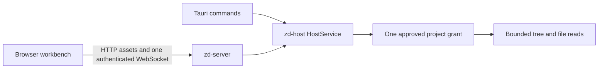

# Run the experimental served host

The served-host target proves that a browser can use the same Rust host boundary as the desktop
application. It is a development target, not an installed `zd serve` command. This first slice can
list one approved project and open bounded text files. It is intentionally read-only.



The browser and Tauri paths share `zd-host`; they do not contain separate grant, tree, or file-read
implementations. Later work will move mutation, Git, file watching, terminal sessions, and durable
workbench state behind this same host boundary.

## Run it on the same machine

From the repository root, run:

```sh
npm run app:serve -- /absolute/path/to/project
```

The command builds the web application, approves the supplied directory, binds an available port on
`127.0.0.1`, and prints two separate lines after the routes are ready:

```text
zd serve URL: http://127.0.0.1:<ephemeral-port>/
zd serve secret: <process-secret>
```

Open the URL, enter the process secret in the unlock page, and select **Unlock**. The secret is sent
in the first WebSocket frame. It is not put in the URL, cookies, browser storage, diagnostics, or
ordinary application logs.

Use `Ctrl+C` in the command shell to stop the host.

## Connect through SSH

Start the host on the remote machine and keep that shell open:

```sh
npm run app:serve -- /absolute/path/to/project
```

Copy the numeric port from the printed URL. On the local machine, forward a local loopback port to
that remote loopback port:

```sh
ssh -N -L 4317:127.0.0.1:<remote-port> <remote-host>
```

Open `http://127.0.0.1:4317/` locally and enter the separately printed process secret. The local
forwarding port can differ from the remote port. The protocol checks that both the browser Origin
and HTTP Host use the same numeric-loopback authority; it does not trust forwarding headers.

For a known remote port, append `--port <port>` after the project path. Port `0`, the default, asks
the operating system for an available port without a probe-then-bind race.

## Current limits

The development target accepts one authenticated controller and exposes only these protocol
methods:

- `session.describe`
- `projectGrants.list`
- `fileTree.snapshot`
- `file.readBounded`

It does not expose file mutation, Git, worktrees, file watching, terminals, diagnostics storage,
custom themes, workspace persistence, project picking, recent-project recovery, or another project
root. Project files are never served as HTTP assets.

The initial resource bounds are:

| Resource | Limit |
| --- | ---: |
| WebSocket message | 64 KiB |
| Pending browser requests | 32 |
| Browser timing records | 128 |
| Reported host queue or handler duration | 60 seconds |
| File-tree entries | 20,000 |
| Retained ignored entries | 256 |
| File-tree depth | 64 |
| Bounded text file | 8 MiB |
| Oversize text preview | 64 KiB |

## Verify the path

Run the focused real-browser target:

```sh
npm run test:e2e:served
```

The target builds and starts the real Rust server against a generated temporary project. Chromium
unlocks the host, renders the tree, opens a known file, proves that editing and excluded features
are refused, checks that the secret is absent from browser persistence and requests, and confirms
that project content cannot be fetched as an HTTP asset.
