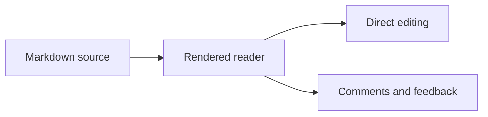

# Markdown rendering reference

Open this file in zd when you need to check the Markdown reading and editing surface by eye. The
examples stay intentionally stable so visual changes are easy to spot.

## Prose and inline text

This paragraph includes _emphasis_, **strong text**, **_strong emphasis_**, ~~strikethrough~~,
`inline code`, an [internal link](../DESIGN.md), and an [external link](https://example.com).

Literal notation can be escaped: \*not emphasis\*, \# not a heading, and `` `inside backticks` ``.

## Heading scale

### Heading level three

#### Heading level four

##### Heading level five

###### Heading level six

Setext heading level two
------------------------

## Lists

- One unordered item
- One item with **emphasis**
  - A nested item
  - Another nested item

1. First ordered item
2. Second ordered item
   1. Nested ordered item

- [x] Completed task
- [ ] Open task

## Quote and rule

> Markdown should remain comfortable to read while it is directly editable.
>
> A second paragraph can stay inside the same quote.

---

## Table

| Surface     | Input                  | Expected result  |
| :---------- | :--------------------- | :--------------- |
| Inline      | `**strong**`           | Emphasized prose |
| Block       | A fenced language      | Highlighted code |
| Diagram     | A `mermaid` fence      | Rendered SVG     |
| Local media | A relative image path | Project image    |

## Local image

The image below resolves relative to this document through the active project.


## TypeScript fence

```typescript
interface Note {
  readonly title: string;
  readonly complete: boolean;
}

const note: Note = { title: "Check Markdown", complete: false };
console.log(note.title);
```

## Rust fence

```rust
fn main() {
    let surface = "Markdown";
    println!("{surface} stays readable");
}
```

## Shell fence

```bash
zd md docs/markdown-demos/demo.md
```

## JSON fence

```json
{
  "surface": "markdown",
  "focusMode": true
}
```

## CSS fence

```css
.reader {
  max-width: 72ch;
  margin-inline: auto;
}
```

## HTML fence

```html
<article aria-label="Markdown specimen">
  <p>Raw markup stays code inside this fence.</p>
</article>
```

## Unknown-language fence

```made-up-language
This fence should remain readable even when no syntax grammar exists.
```

## Indented code

    const rendered = true;
    const editable = true;

## Mermaid diagram


