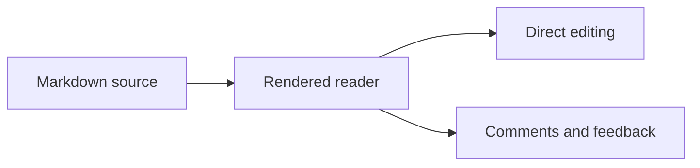
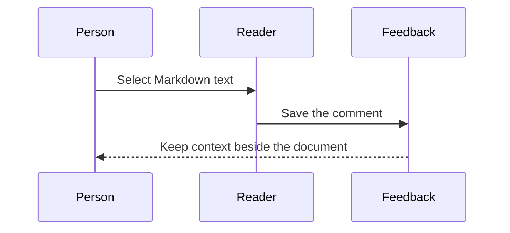

# Mermaid diagrams demo

## Flowchart

```mermaid
flowchart LR
  Source[Markdown source] --> Reader[Rendered reader]
  Reader --> Edit[Direct editing]
  Reader --> Review[Comments and feedback]
```

## Sequence diagram

```mermaid
sequenceDiagram
  participant Person
  participant Reader
  participant Feedback
  Person->>Reader: Select Markdown text
  Reader->>Feedback: Save the comment
  Feedback-->>Person: Keep context beside the document
```
